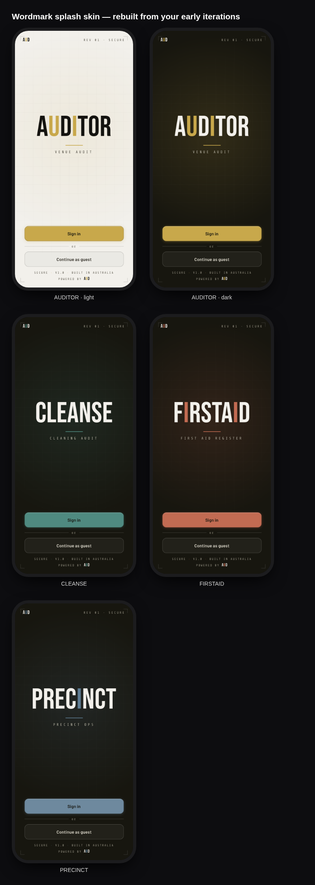

# Splash skin revisions

Saved design revisions for the suite sign-in splash. Each is a real,
selectable `@aud/brand` component (same props shape — `appName`, `family`,
`theme`, `formMode` + `children`, `primary`/`secondary`), so an app switches
skins by swapping one component.

## Shipped / in use
- **`DuotoneSplash`** — full-bleed duotone colour fill (edge to edge), minimal
  chrome, "powered by AuD" foot. *Live: Precinct Ops, First Aid.*
- **`EditorialSplash`** — luxury field-journal masthead (Fraunces/Newsreader).
- **`DuotoneMissionControl`** / **`EditorialMissionControl`** — suite hubs.

## Saved revisions (available, not wired into an app)

### Wordmark — `WordmarkSplash`

Rebuilt from the early "AUDITOR / CLEANSE / FIRSTAID" iterations. A big
Bebas-Neue stencil **wordmark** with a per-letter accent (e.g. AUDITOR's
**u + i** = "you & i"), a thin accent rule, and a tracked mono subtitle, set in
the calibrated "instrument" chrome: AuD lettermark + `REV · SECURE` top row,
faint edge-faded grid, an accent glow, corner registration ticks, and a
`SECURE · <ver> · BUILT IN AUSTRALIA` / `POWERED BY AuD` foot.

- Per-family accent (audits brass · dashboards steel · registers clay · logs
  sage) + light/dark grounds; `accent` override supported.
- Props: `wordmark` (the big word; defaults to `appName` upper-cased),
  `accentLetters` (indices to accent), `subtitle`, `rev`, `version`, `region`.
- Bakes in the iPhone-fit + iOS-standalone work (absolute stage in a
  fixed-height `overflow:hidden` outer, safe-area-inset padding, scroll-lock via
  `useTakeoverBody`, wordmark auto-fit so long names never clip).

Status: **saved as a revision** — not consumed by any live app yet.
