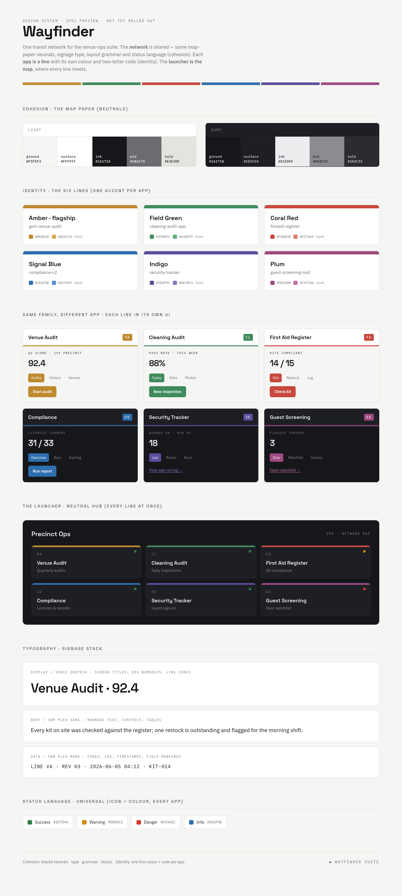

# Proposal · Wayfinder — a fresh cross-app scheme

> **Status: PROPOSAL — not adopted.** This is a new direction explored alongside the
> canonical `@aud/brand` system, **not** a change to it. Nothing under `src/`,
> `tokens/`, or `fonts/` is touched — the live apps that consume `@aud/brand` are
> unaffected. Adopt, revise, or discard at will.
>
> Preview: open [`specimen.html`](./specimen.html) in a browser, or see the render
> below.



---

## Why this exists

The venue-ops apps each picked colours independently (gom-venue-audit's multi-colour
safelist, cleaning's `#3b82f6` blue, firstaid's `#14b8a6` teal, compliance's OKLch
teal/amber, security's amber), so they don't read as one family. `@aud/brand` was built
to solve exactly this with a warm "military-grade" maker's mark — but this proposal asks
a different question: *if we started the palette + theme fresh, keeping only the proven
**structure** (constant neutrals + one accent per app + light/dark), what would it be?*

**Design intent:** cohesion (you can tell they're siblings) **and** identity (you can
tell which app you're in).

---

## The theme: a transit network

One metaphor carries cohesion + identity cleanly: **a transit/wayfinding network.**

- The **network** is shared — same "map paper" neutrals, signage typography, layout
  grammar and status language. That's the cohesion.
- Each **app is a line** with its own line colour and two-letter code. That's the
  identity — transit palettes are engineered to be maximally distinguishable yet
  harmonious as a set.
- The **launcher is the map / interchange** — the one surface where every line meets.

*"Wayfinder" is a working name — trivially renameable (Precinct, Network, Signal…).*

---

## Cohesion layer (identical across every app)

### Neutrals — the "map paper"

| Token | Light | Dark | Role |
|-------|-------|------|------|
| `ground`  | `#F5F5F3` | `#16171B` | page background |
| `surface` | `#FFFFFF` | `#1D1F24` | cards, raised surfaces |
| `ink`     | `#16171A` | `#ECEDEF` | primary text |
| `mid`     | `#6B6C70` | `#8A8C92` | secondary text, labels |
| `rule`    | `#E3E3DF` | `#2A2C32` | hairline borders, dividers |

### Typography — signage stack (self-hosted, SIL OFL, open)

| Role | Face | Use |
|------|------|-----|
| Display / wayfinding headings | **Space Grotesk** | screen titles, big numerics, line codes |
| Body / UI | **IBM Plex Sans** | running text, controls, tables |
| Data / field labels | **IBM Plex Mono** | codes, IDs, timestamps, `LINE VA`-style markings |

Micro-labels uppercase, letter-spacing `0.12–0.2em`. Body sentence case, line-height ~1.5.

### Status language — universal (icon + colour, never colour alone)

| State | Colour |
|-------|--------|
| Success | `#2E7D46` |
| Warning | `#D08A12` |
| Danger  | `#D33A2C` |
| Info    | `#2E6FAE` |

### Layout grammar

Generous whitespace; hairline `rule` borders do the structural work; shadows
subtle/absent; small radii (4–8px). Every app header carries app name + line code (mono)
+ a thin **line bar** in the app's accent. A small shared footer signature ties the
suite together.

---

## Identity layer — one line colour per app

A tuned six-hue set, evenly spread at a consistent muted-but-confident register. Each has
a **base** (light) and a **dark tint** (lighter, for the dark ground).

| Line | Base | Dark tint | App | Why it fits |
|------|------|-----------|-----|-------------|
| **Amber** (flagship) | `#BE8A2E` | `#DEAC52` | gom-venue-audit | gold = standard / quality / inspection |
| **Field Green** | `#3F8B5C` | `#62B07E` | cleaning-audit-app | clean / fresh / "go" |
| **Coral Red** | `#C8483E` | `#E27A6F` | firstaid-register | care/medical without true-alarm red |
| **Signal Blue** | `#2E6FAE` | `#5C94CF` | compliance-v2 | trust / authority / records |
| **Indigo** | `#5A4F9C` | `#867BC6` | security-tracker | night shift / vigilance |
| **Plum** | `#9E4A80` | `#C571A6` | guest-screening-tool | discretion / door / welcome |

**Accent discipline:** the line colour drives the header bar, active/selected states,
primary action, links, app mark, and the single most important element. One accent per
app; neutrals still dominate. A coloured header bar is fine; a screen *washed* in accent
is not.

---

## Per-app assignment (the map)

| App | Line | Base hex | Code | Default mode |
|-----|------|----------|------|--------------|
| gom-venue-audit | Amber | `#BE8A2E` | `VA` | Light |
| cleaning-audit-app | Field Green | `#3F8B5C` | `CL` | Light |
| firstaid-register | Coral Red | `#C8483E` | `FA` | Light |
| compliance-v2 | Signal Blue | `#2E6FAE` | `CO` | Dark |
| security-tracker | Indigo | `#5A4F9C` | `SE` | Dark |
| guest-screening-tool | Plum | `#9E4A80` | `GS` | Dark |
| **precinct-ops-dashboard** | — (neutral hub) | — | `OPS` | Dark |

Default mode tracks work context (field/desk = light, control-room/night = dark); every
app still ships both themes.

### The launcher as neutral hub

`precinct-ops-dashboard` carries **no line colour of its own** — it's the network map: a
dark ground with a grid of module tiles, each wearing its own line colour (coloured bar +
code + name). The single surface where all six lines appear together, which is what
visually proves the suite is one family.

---

## How it would be expressed (token spec, for a future rollout)

Same mechanism `@aud/brand` uses — CSS custom properties + an optional Tailwind preset —
so a later rollout is a drop-in.

```css
:root {                      /* shared, every app */
  --wf-ground:#F5F5F3; --wf-surface:#FFFFFF; --wf-ink:#16171A;
  --wf-mid:#6B6C70; --wf-rule:#E3E3DF;
  --wf-success:#2E7D46; --wf-warning:#D08A12; --wf-danger:#D33A2C; --wf-info:#2E6FAE;
}
[data-theme="dark"] {        /* shared dark overrides */
  --wf-ground:#16171B; --wf-surface:#1D1F24; --wf-ink:#ECEDEF;
  --wf-mid:#8A8C92; --wf-rule:#2A2C32;
}
:root { --wf-accent:#3F8B5C; --wf-accent-tint:#62B07E; } /* per app, e.g. cleaning */
```

Line constants (`--wf-amber`, `--wf-coral`, `--wf-green`, `--wf-blue`, `--wf-indigo`,
`--wf-plum`) live in the shared sheet so the launcher can paint every tile from one source.

---

## Open levers (cheap to change — nothing is shipped)

- **Temperature** — slightly cool-neutral for "fresh"; can re-warm toward `@aud/brand`'s paper.
- **Colour confidence** — line bars / coloured headers allowed; can tighten to strict accent-only.
- **Type stack** — Space Grotesk + IBM Plex Sans/Mono; swappable.
- **Per-app hue assignment** — defensible but tweakable (swap security↔guest, cleaning→teal…).
- **System name** — "Wayfinder" is a placeholder.

---

## Relationship to `@aud/brand`

`@aud/brand` remains the canonical, adopted system. Wayfinder is a parallel exploration
for a fresh direction. If adopted, the natural path is to package it the same way
(`tokens.css`, Tailwind preset, a small component set) and roll out one pilot app first.
Until then this folder is documentation only and changes nothing.
